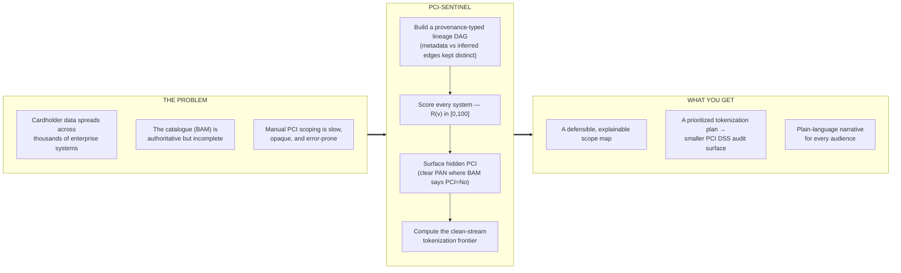

PCI-SENTINEL turns an incomplete system catalogue and a sprawl of cardholder-data
relationships into a defensible, explainable map of true PCI scope — and a ranked
plan for shrinking it.

- **The problem.** Cardholder data flows across thousands of enterprise systems. The
  business catalogue (BAM) is the system of record, but it is incomplete — and
  scoping a PCI DSS audit by hand is slow, opaque, and easy to get wrong.
- **The engine.** A deterministic graph engine builds a provenance-typed lineage DAG
  (metadata edges and inferred signals kept strictly distinct), scores every system
  on a bounded 0–100 risk model, surfaces *hidden* PCI systems carrying clear PAN
  that BAM never flagged, and computes the **clean-stream tokenization frontier** —
  where tokenizing a true source descopes everything downstream.
- **What you get.** A scope map you can defend line-by-line, a prioritized
  tokenization plan that measurably reduces audit surface, and a plain-language
  narrative — produced by the LLM over the engine's grounded results — so a
  compliance lead, an auditor, and an engineer can each act on the same analysis.


> **Hybrid Intelligence:** a deterministic graph engine performs every verifiable computation; the LLM owns the explanation layer that turns those grounded results into language a compliance lead, an auditor, and an engineer can each act on.

## Data inputs — two classes, never conflated

**BAM extracts (DS1–DS4) — authoritative system of record.** Define which systems exist and the documented data-flow relationships between them.
- **DS1** — PCI systems with upstream/downstream relations
- **DS2** — all systems upstream → PCI
- **DS3** — all systems downstream ← PCI
- **DS4** — any system carrying PCI data

**Supplemental feeds (DS5–DS6) — signals only, never ground truth.** Can surface a candidate BAM missed, but rendered distinctly and never promoted to fact.
- **DS5** — CDE end-state survey (declared target-state / detokenization)
- **DS6** — Splunk clear-PAN findings (PAN in logs for systems marked PCI=No in BAM)

## Agentic pipeline — LangGraph StateGraph (checkpointed · resumable · audited per stage)

**Supervisor / Orchestrator (control).** Owns graph state, routing, retries, and the human approval gate — drives every other agent.

### Deterministic graph engine — verifiable, reproducible (8 of 9 agents)
1. **Ingestion & Sanitiser** — loads CSVs, validates schema, masks PAN first-6/last-4 at the boundary. Nothing unmasked passes downstream.
2. **Masking-Leak Validator** — Luhn + pattern scan on every cell. The run **FAILS** if any unmasked PAN escapes. *(Safety — hard fail.)*
3. **Graph Builder** — builds the cardholder-data flow graph as a typed MultiDiGraph, metadata vs inferred edges kept distinct.
4. **Cycle Resolver** — Tarjan SCC → condensation so lineage is a valid DAG.
5. **Quant / Scoring** — composite risk score, bounded 0–100, every term named: `R(v) = 100 · (.40·S + .30·R + .20·B + .10·T)`.
6. **Core Analyst** — the analytical heart: reachability, exclusive-reach sets, clean-stream impact, heavy hitters, hidden PCI (BAM misses).
7. **Human-in-the-Loop Gate** — the run genuinely pauses for a reviewer to approve, revise, or abort before anything is reported. *(LangGraph INTERRUPT · human.)*

### Explanation layer
8. **Reporter — the explanation engine.** A ~4,000-system risk graph is useless to the people who have to act on it unless someone can say, in plain language, *which* systems are in scope, *why*, and *what to do first*. That translation is the Reporter's job: it consumes the deterministic engine's grounded results and produces audience-ready lineage, "why-in-scope" reasoning, and prioritized narrative for compliance leads, auditors, and engineers alike. Because every figure it speaks is one the engine already proved, its output is always anchored to the data — and the model sits behind a config-swappable client, so there's **no vendor lock**.

> **Why it matters:** the engine guarantees the numbers are *correct*; the explanation layer makes them *usable*. Most systems make you choose between a black box you can't audit and a spreadsheet no executive will read — PCI-SENTINEL delivers both rigor and legibility, with no risk of a fabricated figure.

## Delivery
- **FastAPI service** — async, typed Pydantic I/O, OpenAPI docs, fresh-frontier recompute on report endpoints.
- **React 18 + D3 frontend** — 13 analyst tabs (overview, business view, flow graph, exposure map, planner, drill-down, methods…).
- **Reports & evidence bundle** — PDF executive report, XLSX charted dashboard, metrics + per-stage audit trail.

## Cross-cutting guarantees
- **Masking-leak safety** — run FAILS on any unmasked PAN
- **Per-stage audit log** — every stage emits an audit record
- **Provenance preserved end-to-end** — metadata vs inferred edges stay distinct
- **LLM behind a config-swappable client** — no vendor lock

**Legend:** Control · Deterministic engine · Human gate · LLM (narration) · Safety / critical


## How to read this flow

A LangGraph StateGraph. **Solid arrows = the main path;** the two conditional gates (Validate, Human review) can branch to abort or loop back to re-analyze. The run executes left → right, top → bottom.

### Main path

1. **START → Stage 1 · Control.** Initializes graph state, routing, and retries; drives every stage. *(→ run context + audit start.)*
2. **Stage 2 · Ingest & Sanitise (deterministic).** Loads CSVs, validates schema, masks PAN first-6/last-4 on entry. *(→ masked typed dataset.)*
3. **Stage 3 · Validate — masking-leak safety gate.** Luhn + pattern scan on every cell. **Conditional:** a clean dataset continues (`clean ✓`); any unmasked PAN branches to **ABORT** (`leak ✗`).
4. **Stage 4 · Build Graph (deterministic).** Typed MultiDiGraph of PAN flow, metadata vs inferred edges kept distinct. *(→ interdependency graph G.)*
5. **Stage 5 · Condense to DAG (deterministic).** Tarjan SCC → condensation; acyclicity asserted. *(→ acyclic lineage DAG.)*
6. **Stage 6 · Score / Quant (deterministic).** Composite risk `R(v) ∈ [0,100]`, four named, bounded factors. *(→ per-system risk scores.)*
7. **Stage 7 · Analyze / Core (deterministic).** Scope, heavy hitters, clean-stream impact, hidden PCI. *(→ findings + visual contracts.)*
8. **Stage 8 · Human-in-the-Loop gate.** Run pauses (LangGraph interrupt). **Conditional — decision required:** *Approve* continues (`approve ✓`); *Revise* loops back to Stage 7 to re-run analysis with reviewer feedback; *Abort* halts.
9. **Stage 9 · Report (LLM narrate) → END.** The LLM explains the computed numbers in plain language for the people who must act on them — never deciding, always anchored to what the engine proved. *(→ PDF · XLSX · UI JSON.)*

### The two branches off the main path

- **Leak ✗ / gate abort ✗ → ABORTED.** Both a masking leak (Stage 3) and a reviewer abort (Stage 8) land here: the run halts safely and **no report is produced**.
- **Revise ↺.** From the human gate, a "revise" decision re-runs analysis (Stage 7) with the reviewer's feedback before reporting — the human can steer the result, not just rubber-stamp it.

**What the diagram proves:** the safety gate and human gate are *real control flow*, not decoration — the run can genuinely stop or loop. Card data is masked before anything else happens, a leak kills the run, and nothing reaches a report until a human approves it.


# PCI-SENTINEL — Methodology & Architecture

PCI-SENTINEL maps how cardholder data (PAN) flows across an enterprise's systems, identifies where that data originates, and quantifies what tokenizing each origin would remove from PCI-DSS audit scope. It is built on one principle we call **Hybrid Intelligence**: a deterministic graph engine performs every verifiable computation, and a language model is used only to narrate the numbers that engine has already produced. Nothing the system reports as a fact is invented by an LLM — every score, edge, and recommendation traces back to a rule, a graph operation, or a cited algorithm.

That separation is not cosmetic. It is what lets the output survive expert scrutiny: a reviewer can re-derive any number by hand, and the same inputs always produce the same result.

---

## 1. Architecture


**Inputs.** The system distinguishes two classes of input and never conflates them. The four BAM extracts (DS1–DS4) are the authoritative system of record — they define which systems exist and the documented data-flow relationships between them. The two supplemental feeds, the CDE end-state survey (DS5) and the Splunk clear-PAN findings (DS6), are treated as *signals only*: they can surface a candidate that BAM missed, but they are rendered distinctly throughout and are never silently promoted to ground truth.

**The agent pipeline is the core of the system.** Work is decomposed into nine single-responsibility agents wired together as an explicit, checkpointed LangGraph state machine. Each agent owns one job, has typed inputs and outputs, and emits an audit line so the agentic structure and run cost are visible end to end. Critically, the agents are colour-coded by what they actually do:

- The **Supervisor** (control) owns graph state, routing, and retries — it is the agent that drives every other agent.
- The **deterministic engine** is six agents doing verifiable, reproducible work with no black box: ingestion and PAN masking, the masking-leak validator, the graph builder, the cycle resolver, the quant/scoring agent, and the core analyst.
- The **Human-in-the-Loop Gate** genuinely pauses the run for a reviewer to approve, revise, or abort before anything is reported.
- The **Reporter** is the *only* step that uses an LLM, and it is constrained to narrating the already-computed numbers. It explains; it never decides.

Eight of the nine agents are deterministic. This is the concrete form of the Hybrid-Intelligence claim, and it is enforced by the architecture rather than asserted in a slide.

**Delivery.** Results are served by an async FastAPI service with typed Pydantic contracts, consumed by a React 18 + D3 frontend (thirteen analyst views), and packaged as a PDF executive report and an XLSX workbook with a charted dashboard, plus a metrics-and-audit evidence bundle for reproducibility.

**Cross-cutting guarantees** apply at every stage: the run *fails hard* if any unmasked PAN is ever detected, each stage writes an audit record, metadata-versus-inferred provenance is preserved throughout, and the LLM sits behind a config-swappable client so there is no vendor lock-in.

---

## 2. Process flow


The pipeline runs as nine explicit LangGraph stages. Because state is checkpointed at every step, the run is **resumable** — a paused or interrupted run continues from where it stopped rather than recomputing from scratch.

1. **Supervisor** initializes run context, routing, and the audit trail.
2. **Ingest & Sanitise** loads the CSV exports, validates their schema, and masks PAN to first-6/last-4 *at the boundary* — nothing unmasked passes downstream.
3. **Validate (masking leak)** is the first safety gate: a Luhn-plus-pattern scan of every ingested cell. Any unmasked PAN aborts the entire run.
4. **Build Graph** constructs the system interdependency graph of PAN flow as a typed MultiDiGraph, keeping metadata (BAM) and inferred (survey/Splunk) edges separate.
5. **Condense to DAG** finds circular dependencies with Tarjan's strongly-connected-components algorithm and condenses each cycle into a super-node, so lineage becomes a valid directed acyclic graph.
6. **Score (Quant)** assigns every system a bounded composite risk score (Section 3).
7. **Analyze (Core)** computes PCI scope, the heavy-hitter distributors, the clean-stream tokenization impact, and the hidden-PCI findings, and shapes them into the contracts the UI consumes.
8. **Human-in-the-Loop Gate** pauses for a reviewer. Approve sends the run to the Reporter; *revise* loops back to Analyze with reviewer feedback; abort halts safely.
9. **Report** uses the LLM to narrate the computed findings in plain language and emits the PDF, XLSX, and UI JSON.

There are exactly **two branch points**, and both are deliberate: the masking-leak validator can abort on a safety failure, and the human gate can approve, loop back, or abort. Everything else is a straight, deterministic path.

---

## 3. Risk score — calculation logic


Each system receives a composite exposure score on a 0–100 scale:

> **R(v) = 100 × ( 0.40·S + 0.30·R + 0.20·B + 0.10·T )**

It is a weighted sum of four normalized factors, each individually defensible:

- **S — Sensitivity (weight 0.40).** `sensitivity_tier / 4`. What cardholder data the system declares, from BAM/DS4: tier 4 for untokenized PAN, track data, PIN, or a detokenization service; tier 3 for CRN-only / PCI-connected; tier 2 for inferred PAN from the DS6 signal. This follows the PCI-DSS ordering of how decisive each data element is, which is why it carries the largest weight.
- **R — Reach (weight 0.30).** `|descendants(v)| / max_reach`. The downstream blast radius: how many systems v can propagate PAN to, via the transitive closure of the data-flow graph. It is scaled to the most-reaching system so that "the widest distributor" carries the full reach weight relative to the actual estate.
- **B — Betweenness (weight 0.20).** `betweenness(v) / max_betweenness`. The conduit role — how many shortest PAN paths route through v — which captures choke-points that raw reach misses. It is exact on small graphs and uses pivot-sampled betweenness (k = 400, fixed seed) above 600 nodes so scoring stays sub-second at enterprise scale.
- **T — True-source flag (weight 0.10).** 1 if v has in-degree 0 in the data-flow graph and originates PAN, else 0. True sources are where tokenization produces the clean-stream effect, so this is a small but decisive tie-breaker toward where intervention has leverage.

**Why max-scaling.** Each varying factor is scaled to its observed maximum rather than divided by (N−1). Without this, reach on a large estate occupies only a tiny sub-range and a nominal 0.30 weight would move the score by a couple of points at most. Max-scaling makes the published weights reflect real influence on the result.

**Worked example (verifies against the shipped number).** For system **8MEC**, a tier-4 true PAN source:

```
S = 4/4               = 1.000   → 0.40 × 1.000 = 0.400
R = 27 / 33           = 0.818   → 0.30 × 0.818 = 0.245
B = betweenness norm  = 0.000   → 0.20 × 0.000 = 0.000
T = true source       = 1       → 0.10 × 1     = 0.100
R(8MEC) = 100 × (0.400 + 0.245 + 0.000 + 0.100) = 74.55
```

That equals the score the system actually reports for 8MEC — the arithmetic is fully transparent and checkable.

**Why it is defensible.** The weights are configurable (they sum to 1.0 and can be overridden via environment for tuning), but the ranking is **structural, not tuned**: re-running with different weights leaves the ordering essentially unchanged (a weight-sensitivity correlation of ρ ≈ 1.00), because the order is driven by the graph rather than fitted to a desired answer. Every term is named, bounded, and cited (Freeman 1977 and Brandes 2001 for betweenness, Brandes & Pich 2007 for the unbiased sampled estimator, PCI-DSS for the data-element ordering, Tarjan for the cycle resolver), the four factor values are exposed per system for audit, and the computation is deterministic.

---

## 4. What the system claims — and what it does not

PCI-SENTINEL presents current-state PCI data-flow lineage from BAM (authoritative) plus clearly-marked inferred signals, with cycle resolution and a reproducible risk model. It does **not** remediate controls, assert business need, or treat inferred signals as ground truth. Card numbers are masked first-6/last-4 on ingest, and an unmasked PAN fails the run. Where Splunk findings are shown, absence of a finding is not treated as proof a system is clean — the feed lists observations, not a comprehensive sweep. This honesty boundary is deliberate: the value is in a defensible map of where cardholder data really flows, not in over-claiming.
