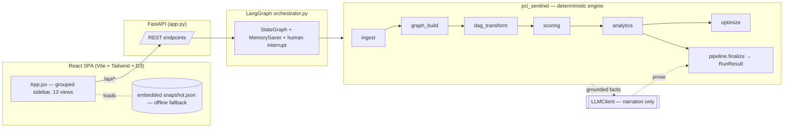
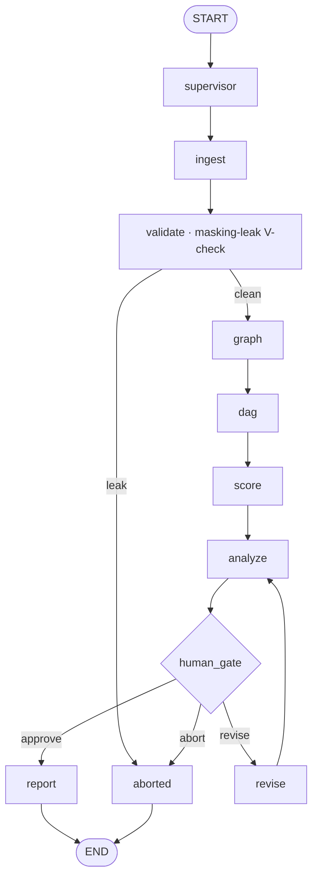

# PCI-SENTINEL — Architecture

This document describes how the system is built: its components, the deterministic
engine modules, the agentic orchestration, the data model, the scoring and optimization
methods, and the design rules that hold across the codebase. For the runtime sequence
see [`processflow.md`](processflow.md); for the rationale see [`solutionoverview.md`](solutionoverview.md).

## 1. High-level structure

Three layers:

- **Frontend** — a single-page React app (`frontend-app/src/App.jsx`) that renders 13
  views grouped into a left sidebar (Operations / Lineage / Governance). It talks to the
  backend over `/api/*` (Vite proxies `:5173 → :8000`) and falls back to an embedded
  JSON snapshot so the dashboard renders with no backend. A dependency-free
  `frontend/standalone.html` exists for locked environments.
- **API** — `backend/app.py`, a FastAPI service: upload-driven analysis, the approval
  gate, per-view reads, report downloads, what-if/onboarding simulators, and grounded
  chat. Auto-generated OpenAPI docs at `/docs`.
- **Engine** — the `backend/pci_sentinel/` package: a deterministic spine wrapped in a
  LangGraph state machine, plus a thin, swappable LLM client used solely for narration.

## 2. The deterministic engine (`pci_sentinel/`)

| Module | Responsibility |
|---|---|
| `schema.py` | Normalize CSV headers; identify each dataset (DS1–DS6) by signature columns and filename hints; extract canonical app IDs. |
| `ingest.py` | Load CSVs into typed rows, route by role, mask PAN in every string cell on entry, emit a data-quality report. |
| `security.py` | The PCI data-handling boundary: Luhn (ISO/IEC 7812) PAN test, first-6/last-4 masking (PCI-DSS 3.4), and `scan_for_leaks` → `PanLeakError`. |
| `graph_build.py` | Build the provenance-typed `MultiDiGraph` (and an authoritative-only `DiGraph`); derive PAN/sensitivity attributes from DS4; identify true PAN sources. |
| `dag_transform.py` | Tarjan SCC detection (iterative) → condensation into a verified DAG; cycles preserved as super-nodes. |
| `scoring.py` | Composite risk score `R(v) ∈ [0,100]` from four normalized, cited factors. |
| `analytics.py` | The analytical heart: PCI scope, scope split, heavy hitters, clean-stream impact, per-source exposure, saturation/cumulative curves, block-set comparison, hidden scope, weight sensitivity, graph-structure metrics, scope categories, economics, segmentation candidates, Sankey, ownership rollup, onboarding assessment. |
| `optimize.py` | Certified-optimal tokenization frontier (MILP / branch-and-bound) + greedy gap, and max-flow/min-cut segmentation (Menger). |
| `scoring.py` / `config.py` | All tunables: risk weights, sensitivity tiers, cost model, provenance labels — env-overridable, nothing hard-coded. |
| `llm_client.py` | The generic `LLMClient` abstraction (offline / http / sdk). |
| `narrate.py` / `chat.py` | Grounded AI decision memo; grounded Q&A. |
| `reporting.py` / `report_charts.py` | PDF executive report + XLSX data pack; matplotlib business figures. |
| `pci_requirements.py` | Map systems/findings to PCI DSS v4 requirement families. |
| `pipeline.py` | The linear spine and `finalize()` — the single place that assembles the `RunResult`. |
| `orchestrator.py` | The LangGraph `StateGraph`, the human gate, and resume/abort handling. |
| `agents.py` | The agent roster (node → name, role, method, kind) the UI renders. |

### Hybrid Intelligence — the deterministic/LLM boundary
Every measured value — scope, reach, betweenness, the optimization frontier, the
economics — is produced by deterministic code. The LLM is touched in exactly one place
(`report` / `finalize`) and only to phrase grounded numbers it never computed. This is
enforced structurally: the engine has no dependency on `llm_client` for any number.

## 3. Agentic orchestration (LangGraph)

The spine is expressed as an explicit `StateGraph` so the agentic structure is real,
inspectable, checkpointed, and resumable.

- **State & checkpointing.** LangGraph state must stay serializable, so heavy objects
  (networkx graphs, dataclasses) live in an in-process store keyed by `thread_id`; the
  state itself carries only serializable summaries. A `MemorySaver` checkpointer persists
  across HTTP calls so an interrupted run can be resumed in a later request.
- **Human-in-the-loop.** `human_gate` uses LangGraph's `interrupt()` — the run genuinely
  pauses and returns `awaiting_approval` with a grounded preview. `approve` proceeds,
  `revise` adjusts the recommendation depth and re-pauses, `abort` ends the run.
  `auto_approve=True` runs unattended (sample data, snapshot generation, tests).
- **Agent roster.** `agents.py` is the source of truth the UI renders: `supervisor`
  (control), `ingest` / `validate_masking_leak` / `build_graph` / `condense_to_dag` /
  `score` / `analytics` (deterministic), `human_gate` (human), `report` (the one LLM
  step). Two routing nodes — `revise` and `aborted` — complete the graph.

## 4. Data model

### Graph artifacts (`graph_build.py`)
- `G` — a `MultiDiGraph` carrying both `metadata` and `inferred` edges (one edge per
  contributing dataset; the viz layer collapses parallels to one visual edge whose
  provenance is `metadata` if *any* contributing edge is authoritative).
- `G_meta` — an authoritative-only `DiGraph` used for the DAG transform and scope split.
- `pan_sources` / `inferred_pan_sources` — PAN origins known from BAM vs from signals only.
- Edge convention (`config.data_flow_edges`, default true): PAN flows
  **provider → consumer** (Child App ID → Parent App ID), so out-degree = number of
  downstream consumers a system distributes PAN to.

### Sensitivity tiers (`config.py`)
`4` untokenized PAN / full track / PIN / detokenizes CRN→PAN · `3` PCI, CRN-only ·
`2` inferred/at-risk (receives PAN or PAN-in-logs, undeclared) · `1` touches the flow,
no PAN · `0` none. Tiers are derived deterministically from DS4 attributes.

### Provenance (first-class, per the rubric)
`PROV_METADATA = "metadata"` (DS1/DS2/DS3, authoritative) and
`PROV_INFERRED = "inferred"` (DS5 survey / DS6 Splunk, signals). Inferred edges are never
merged with metadata edges.

## 5. Scoring model (`scoring.py`)

`R(v) = 100 · (w_s·sensitivity + w_r·reach + w_b·betweenness + w_src·source)`,
default weights `0.40 / 0.30 / 0.20 / 0.10` (sum validated = 1.0, env-overridable):

| Factor | Definition | Foundation |
|---|---|---|
| sensitivity | `sensitivity_tier / 4` from DS4 data elements | PCI-DSS data-element risk ordering |
| reach | `\|descendants(v)\| / max_reach` — downstream blast radius (transitive closure), max-scaled | graph reachability |
| betweenness | betweenness centrality / max — conduit role | Freeman 1977; Brandes 2001 |
| source | `1` if `in_degree = 0` **and** carries/originates PAN | true-source = clean-stream leverage |

Each varying factor is scaled to its observed `[0,1]` range so the published weights
reflect real influence. Betweenness is exact (Brandes) for graphs up to ~600 nodes and a
pivot-sampled, unbiased estimator (Brandes & Pich 2007, `k ≤ 400`, fixed seed) above
that, keeping scoring sub-second at enterprise scale.

## 6. Optimization (`optimize.py`)

- **`descope_frontier`** — for `k = 1…k_max`, the maximum systems that can leave scope by
  tokenizing `k` sources, solved to **proven optimality** (MILP / branch-and-bound over
  coverage atoms), plus the greedy curve and the greedy optimality gap. This is the
  rigorous answer to the supermodularity caveat: rather than rely on a greedy guarantee
  that doesn't hold under conjunctive AND-coverage, the problem is solved exactly and the
  shortfall is quantified.
- **`segmentation_min_cut`** — the minimum integration edges to sever to ring-fence a
  high-value target from every PAN source (max-flow/min-cut, Menger's theorem). This is
  an orthogonal lever to tokenization.

All math is hand-rolled on `networkx` + `numpy` (no `scipy`/`pulp`), so the engine runs
in a dependency-locked environment.

## 7. The LLM client (`llm_client.py`)

A single `LLMClient` with three backends, selected at runtime by
`PCISENTINEL_LLM_BACKEND`:

- **`offline`** — templated, fully-grounded explanation built from the engine's own
  numbers. Zero external dependencies; the default and the safe fallback.
- **`http`** — an OpenAI-compatible REST endpoint (bearer auth).
- **`sdk`** — a pluggable Python client whose module and class are themselves named in
  the environment, constructed with `model_name=<MODEL>` and invoked as
  `client.invoke(messages).content` — for gated enterprise gateways that perform their
  own token exchange / TLS.

A single switch, `self.generative`, decides whether the model may *write* anything; it is
true only for the `sdk` backend. Everywhere else the client returns deterministic
templates with identical numbers. The backend, endpoint, credentials, and model id are
resolved **only** from environment variables (loaded from the git-ignored `backend/.env`
at import) — no provider, vendor, or model name is embedded in source. Any failure
(missing SDK, bad config, rate limit, timeout) degrades to offline, so narration can
never break a run.

## 8. Cross-cutting design rules

- **Independent guards in `finalize()`.** Each enrichment (source exposure, saturation
  curve, block comparison, optimization frontier, decision memo, categories, economics,
  Sankey, segmentation, ownership) is wrapped so a failure in one can only blank its own
  panel — never the spine.
- **Single source of truth.** Both the linear pipeline and the LangGraph orchestrator
  call the same `finalize()`, so the headline, scope split, explanation, and viz payload
  can never drift apart.
- **Fresh report frontier.** The PDF/XLSX endpoints recompute the certified-optimal
  frontier at download time (matching the pipeline's `k_max`), so a report never serves a
  stale frontier cached in an older `RunResult`.
- **Determinism.** Rankings and tie-breaks use explicit, id-based tiebreakers so results
  are reproducible across process runs.

## 9. Scalability

Iterative Tarjan (no recursion-limit risk), max-scaled factors, and sampled betweenness
above a threshold keep the engine responsive on a ~thousands-of-systems estate. The
exposure map is pure layout (one tile per system, no force simulation), and the flow
graph uses focus/ego-views with a node-saturation cap rather than rendering the whole
hairball.

## 10. Tooling & dependencies

`requirements.txt` pins: FastAPI 0.115.6, uvicorn, python-multipart, networkx 3.4.2,
pydantic 2.10.4, `langgraph>=1.1.1,<1.2.0` (the project imports only LangGraph —
`StateGraph`/checkpoint/types — never LangChain itself), pytest, httpx, reportlab
4.4.10, openpyxl 3.1.5, matplotlib 3.10.8. The frontend uses only React, React-DOM, and
D3. `build_snapshot.py` and `build_evidence.py` regenerate the UI JSON and the PDF/XLSX
evidence from the same `RunResult`; the `pytest` suite covers unit, integration, and the
masking-leak safety check.
