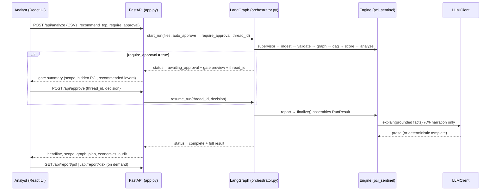
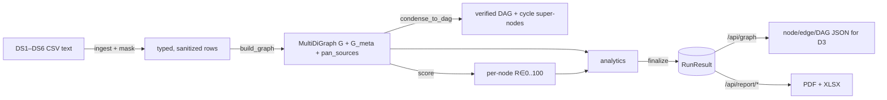
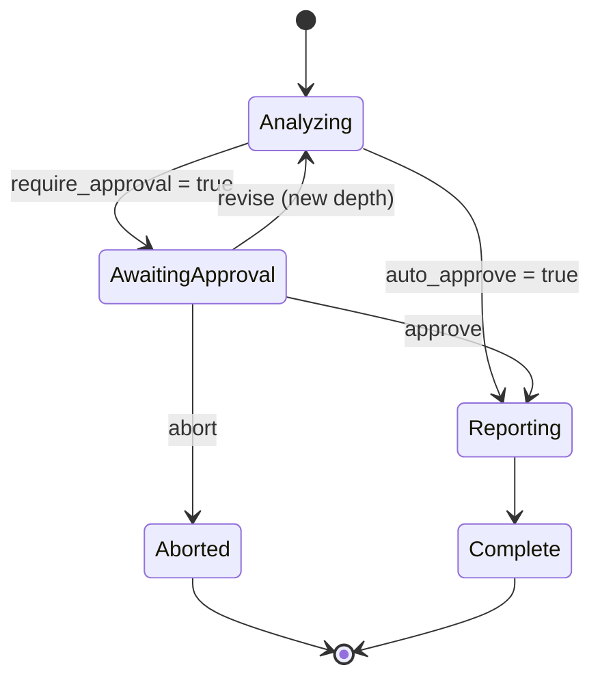

# PCI-SENTINEL — Process Flow

This document traces what happens at runtime, from a CSV upload to a rendered dashboard
and downloadable report. It complements [`architecture.md`](architecture.md) (which
describes the structure) by following the data and control flow step by step.

## 1. End-to-end request lifecycle

The analysis always runs the same deterministic stages; `require_approval` only decides
whether the graph pauses at the human gate before reporting.

## 2. The pipeline stages, in order

Each node logs one audit line (`stage`, elapsed `ms`, key counts). `kind` marks whether
the work is deterministic, the human gate, or the single LLM step.

| # | Node (audit key) | Kind | Input → Output | What happens |
|---|---|---|---|---|
| 0 | `supervisor` | control | — | Initializes orchestration state and routing. |
| 1 | `ingest` | deterministic | CSV text → typed rows + quality report | Detect each dataset (DS1–DS6) by header/filename signature; normalize headers; **mask PAN first-6/last-4 in every string cell on entry**; merge DS1–DS3 as authoritative edge rows; count masked cells. |
| 2 | `validate_masking_leak` | deterministic | all ingested rows → pass/fail | Luhn + pattern scan across every cell. Any unmasked, Luhn-valid PAN past the boundary aborts the run (`PanLeakError`); the route conditionally goes to `aborted`. |
| 3 | `build_graph` | deterministic | rows → graph artifacts | Build the provenance-typed `MultiDiGraph` (`metadata` vs `inferred` edges), an authoritative-only `DiGraph`, derive PAN/sensitivity tiers from DS4, and identify true PAN sources. No node/edge is invented beyond the data. |
| 4 | `condense_to_dag` | deterministic | graph → DAG | Tarjan SCC detection (iterative) condenses each cycle into a super-node; the result's acyclicity is asserted; cycles are kept as auditable detail. |
| 5 | `score` | deterministic | graph → per-node scores | Compute `R(v) ∈ [0,100]` from sensitivity, reach, betweenness, and true-source flag (exact Brandes for small graphs, sampled above threshold). |
| 6 | `analyze` | deterministic | graph + scores → analysis | PCI scope; heavy-hitter distributors (by reach) and solo/exclusive descope; recommended levers; clean-stream impact; minimal tokenization plan; hidden scope. |
| 7 | `human_gate` | human | analysis → decision | If `auto_approve`, approve automatically; otherwise `interrupt()` pauses the run and returns a grounded preview. Decision routes to `report`, `revise`, or `aborted`. |
| — | `revise` | control | feedback → new depth | Adjusts the recommendation depth from feedback and loops back to `analyze`, re-pausing the gate. |
| 8 | `report` | LLM | analysis → `RunResult` | Calls `finalize()` to assemble everything; the LLM narrates the grounded facts (or returns a deterministic template). |
| — | `aborted` | control | — | Records the abort reason and ends. |

## 3. Data transformation through the stages

- **Masking happens once, at ingest**, and is verified at the next stage; everything
  downstream operates only on masked/typed data.
- **The edge convention is provider → consumer**, so a system's out-degree is the number
  of downstream systems it distributes PAN to.
- **Provenance is preserved end to end**: parallel edges from multiple datasets are
  collapsed for display into one visual edge whose provenance is `metadata` if any
  contributing edge is authoritative, else `inferred`.

## 4. What `finalize()` assembles

`finalize()` is the single place that builds the `RunResult`, so the UI, reports, and
gate preview can never disagree. It computes the scope split (metadata-confirmed vs
inferred-only), the executive headline, the grounded LLM explanation, and then — each
guarded independently so one failure can only blank its own panel — per-source exposure,
the saturation and cumulative descope curves, block-set comparison, the certified-optimal
tokenization frontier, the AI decision memo, scope categories, scope economics, the
Sankey payload, graph-structure metrics, min-cut segmentation, the ownership rollup, and
the exact node/edge/DAG JSON the D3 views consume.

## 5. The human-in-the-loop gate

When `require_approval=true`, `/api/analyze` returns `awaiting_approval` with a
`thread_id` and a grounded gate payload (scope size, hidden-PCI count, recommended
interventions). The reviewer then calls `/api/approve` with `approve`, `revise` (e.g.
feedback `"5"` to widen the recommendation), or `abort`. Because the run is checkpointed,
the resume can arrive in a later HTTP request.

## 6. Live read & simulation calls (after a completed run)

Once a run completes, the API serves views and simulators off the latest result and its
retained artifacts:

- `GET /api/headline | /api/graph | /api/heavy-hitters | /api/impact | /api/structure |
  /api/explanation` — read the analysis.
- `GET /api/plan` — recompute the greedy plan and re-attach the saturation curve,
  per-source exposure, block comparison, and persisted decision memo (so live mode shows
  the same panels as the snapshot path).
- `POST /api/whatif {sources}` — impact of tokenizing an arbitrary source set.
- `POST /api/onboard {providers, consumers, flags}` — deterministic pre-onboarding scope
  assessment for a not-yet-built system (unknown names are reported, never invented).
- `GET /api/decision-memo?live=1` — regenerate the memo against the current plan (fresh
  model prose only on the generative `sdk` backend; otherwise the deterministic template).
- `POST /api/chat {question}` — grounded Q&A; common questions are answered
  deterministically from the graph/scores, open-ended ones use the LLM constrained to the
  computed facts.

## 7. Report generation flow

`GET /api/report/pdf` and `/api/report/xlsx` recompute the greedy plan and the
**certified-optimal frontier from current code at download time** (matching the
pipeline's `k_max`), so a report never serves a stale frontier cached in an older result.
`reporting.build_pdf` / `build_xlsx` then render the executive summary, the matplotlib
business figures (`report_charts.py`), the frontier table, and the multi-sheet data pack
— carrying the identical numbers shown in the UI.

## 8. Frontend rendering & offline mode

The React app loads the analysis (live `/api/*` or the embedded `snapshot.json`) and
routes it to 13 views via a single `tab` state and the grouped sidebar. The demo opens on
a focused view (not the full-graph hairball), leads with the hidden-scope finding, and
keeps `metadata` vs `inferred` edges visually distinct throughout. With no backend, the
dashboard still renders from the embedded snapshot, and a dependency-free
`standalone.html` covers locked environments.

## 9. Regenerating artifacts

For a reproducible build, `build_snapshot.py` regenerates the UI JSON and
`build_evidence.py` regenerates the PDF / XLSX / metrics bundle — both from the same
`RunResult` produced by the agentic pipeline — so on-screen, in-report, and in-snapshot
numbers stay in lockstep. `run_demo.py` runs the whole pipeline headless over
`sample_data/` and prints a summary; `make test` runs the pytest suite, including the
masking-leak safety check.
