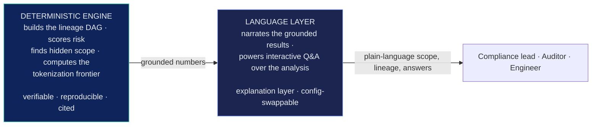
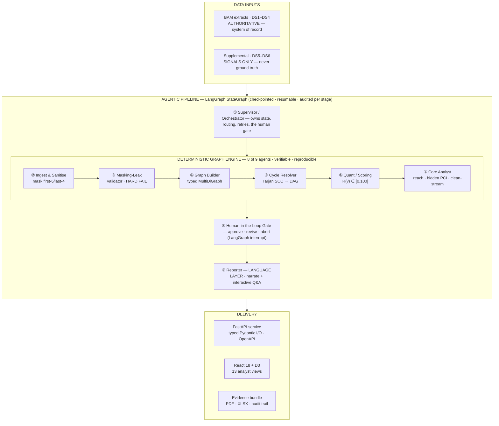
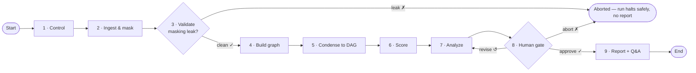
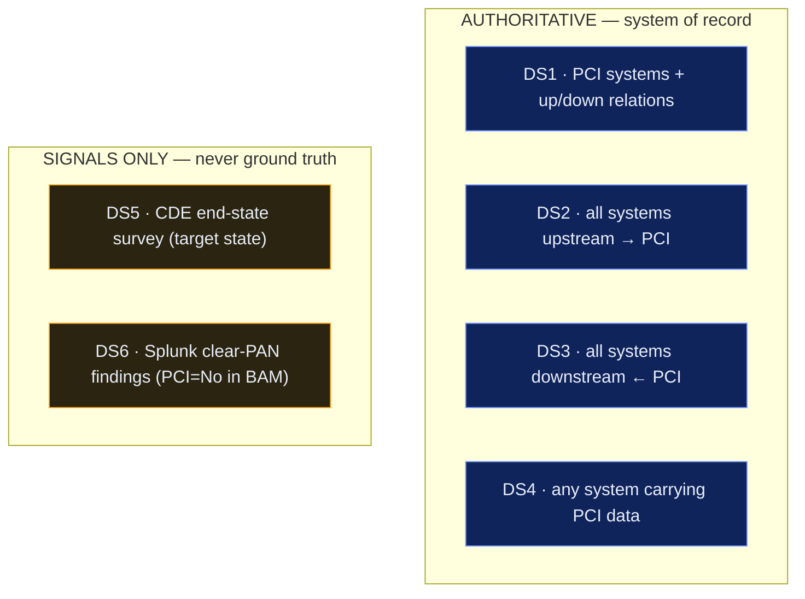
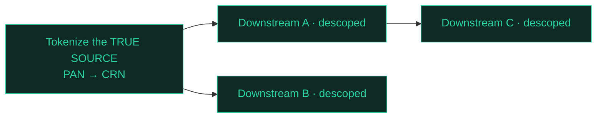
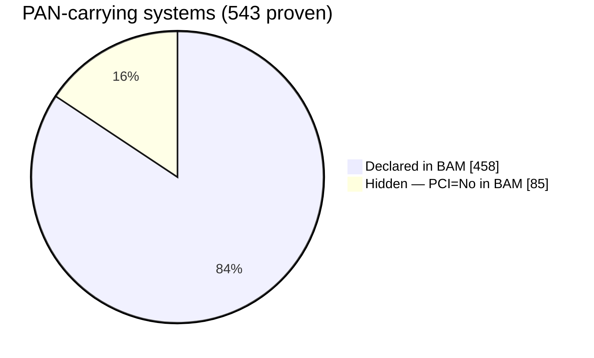

<!--
  MAINTAINER NOTE (hidden in GitHub's rendered view):
  The headline figures here are the verified real ~4,000-system run from the
  Phase-3 review. Re-confirm each against your FINAL run before submission and
  replace anything that moved. Never show dev-dataset numbers. Optimizer/descope
  counts are intentionally described qualitatively (they were still being
  reconciled) — do not paste a specific descope total until it is settled.
-->

# PCI-SENTINEL
### Intelligent Mapping of Interdependencies Across PCI Systems

> An explainable, upload-driven engine that traces clear **PAN** (Primary Account Number) across ~4,000 enterprise systems, surfaces the PCI scope the business catalogue never recorded, and computes where **tokenization (PAN → CRN)** removes the most systems from PCI DSS audit.

**Design philosophy — Hybrid Intelligence:** a deterministic graph engine performs every verifiable computation; a language layer turns those grounded results into plain-language lineage and an interactive Q&A any audience can use. The engine guarantees the numbers are correct; the language layer makes them usable.

---

## At a glance

| What we measured (real ~4,000-system run) | Result |
|---|---|
| Systems in PCI scope | **1,866** (1,823 metadata-confirmed · 43 inferred-only) |
| Hidden PCI systems — clear PAN where BAM says PCI = No | **85** (55 also propagate downstream) |
| PAN carriers **declared** in BAM vs **actually** carrying PAN | **458 → 543** |
| Cycle clusters resolved → acyclic lineage DAG | **2** clusters · **942-node DAG** (from a 2,104-node source graph) |
| Widest PAN distributor / widest one BAM never flagged | `CTNMM` reach **1,817** / `DAU` reach **1,816** |
| Risk-weight sensitivity (ranking is structural, not tuned) | Spearman **ρ ≈ 1.00** |
| Test suite | **22 / 22 passing**, incl. masking-leak safety |

> **The headline:** the catalogue records 458 PAN carriers; the lineage proves 543 — and **85 of them carry clear PAN while marked out of scope.** That gap is unguarded audit risk, surfaced automatically.

---

## Contents

1. [The problem](#1-the-problem)
2. [Solution overview](#2-solution-overview)
3. [Requirements → delivered](#3-requirements--delivered)
4. [System architecture](#4-system-architecture)
5. [Process flow](#5-process-flow)
6. [The nine agents](#6-the-nine-agents)
7. [Data inputs — authoritative vs signal](#7-data-inputs--authoritative-vs-signal)
8. [Mathematical model](#8-mathematical-model)
9. [The clean-stream effect](#9-the-clean-stream-effect)
10. [Sample outputs](#10-sample-outputs)
11. [Features — business view](#11-features--business-view)
12. [The interface — 13 analyst views](#12-the-interface--13-analyst-views)
13. [Why this wins, against the rubric](#13-why-this-wins-against-the-rubric)
14. [Honest by design](#14-honest-by-design)
15. [Tech stack & run](#15-tech-stack--run)

---

## 1. The problem

Cardholder data spreads across thousands of interconnected enterprise systems. The **Business Application Metadata (BAM)** is the authoritative system of record — but it under-reports who actually touches PAN. Scoping a PCI DSS audit by hand is slow, opaque, and error-prone, and every system wrongly in or out of scope is either wasted audit cost or unguarded exposure.

Three failures the business lives with today:

- **Invisible exposure** — systems carrying clear PAN that the catalogue never flagged.
- **No defensible map** — cycles, intermediaries, and convergent feeds make "what flows where" impossible to argue line-by-line.
- **Blind remediation** — tokenize the wrong system and downstream scope barely moves; the leverage points aren't obvious.

The challenge: **map the interdependencies as an explainable DAG, prioritize tokenization for scope reduction, and quantify the impact** — without ever inventing a system or edge the data doesn't support.

---

## 2. Solution overview

PCI-SENTINEL is built as two complementary halves.



- **The deterministic engine** owns every measured value — scope, reach, centrality, risk, the certified-optimal tokenization frontier, segmentation cuts, and the economics. Each figure traces to a rule, a statistic, or a cited algorithm.
- **The language layer** owns the explanation: it turns a 4,000-system graph into audience-ready narrative and drives a conversational interface where reviewers interrogate the findings directly. Because it reasons over numbers the engine already proved rather than inventing them, it informs without ever fabricating a figure.

---

## 3. Requirements → delivered

Mapped point-by-point against what the system actually produces.

| Problem-statement requirement | What we delivered |
|---|---|
| Map interdependencies as an **explainable DAG** | Provenance-typed `MultiDiGraph` → Tarjan SCC → condensation → an acyclic **942-node DAG**; **2** cycle clusters resolved |
| **Distinguish documented vs inferred** edges | Metadata edges (DS1–DS4, authoritative) and inferred signals (DS5–DS6) kept first-class-distinct, rendered differently everywhere — never silently merged |
| **Prioritize tokenization** for scope reduction | Certified-optimal tokenization frontier (branch-and-bound MILP) surfaced in the Planner with a budget slider and ranked leverage points |
| Show the **clean-stream effect** | Clean-stream impact analysis + a cumulative descope curve that shows when downstream scope falls away |
| **Impact analysis** — block a source, measure benefit | Per-source exposure impact (feeds removed, parent-count reduction) + side-by-side block-set comparison in the what-if simulator |
| **Analytics for most-connected systems** | Heavy-hitter ranking by downstream reach (`CTNMM` reaches **1,817**) + drill-down + conversational Q&A |
| **Surface undocumented scope** | **85 hidden PCI systems** — clear PAN observed where BAM says PCI = No |
| **PCI data-handling safety** | Masked first-6/last-4 on ingest; a masking-leak validator **hard-fails the entire run** on any unmasked PAN |

---

## 4. System architecture



**Cross-cutting guarantees:** masking-leak hard-fail · per-stage audit log · metadata-vs-inferred provenance preserved end-to-end · language layer behind a config-swappable client (no vendor lock).

---

## 5. Process flow

The run executes as an explicit state machine. Solid path = main flow; the two gates can branch to abort or loop back to re-analyze.



The gates are **real control flow, not decoration**: card data is masked before anything else happens, a leak kills the run, a reviewer can steer or stop it, and nothing reaches a report until a human approves.

---

## 6. The nine agents

Each agent has a single responsibility, typed inputs/outputs, and emits an audit record.

| # | Agent | Layer | Responsibility |
|---|---|---|---|
| 1 | Supervisor / Orchestrator | Orchestration | Owns graph state, routing, retries, and the human gate — drives every other agent |
| 2 | Ingestion & Sanitiser | Data intake | Loads CSVs, validates schema, masks PAN first-6/last-4 at the boundary |
| 3 | Masking-Leak Validator | **Safety** | Luhn + pattern scan on every cell; any unmasked PAN fails the run |
| 4 | Graph Builder | Lineage | Typed `MultiDiGraph` of PAN flow; metadata vs inferred edges kept distinct |
| 5 | Cycle Resolver | Lineage | Tarjan SCC → condensation so lineage is a valid, acyclic DAG |
| 6 | Quant / Scoring | Analytics | Composite risk score, bounded 0–100, every term named and weighted |
| 7 | Core Analyst | Analytics | Reachability, exclusive-reach, clean-stream impact, heavy hitters, hidden PCI |
| 8 | Human-in-the-Loop Gate | Governance | A real LangGraph interrupt — approve, revise, or abort before any report |
| 9 | Reporter | **Intelligence & narration** | Reasons over the grounded results to produce executive narrative and power the interactive Q&A — the layer that makes a 4,000-system graph usable for every audience |

---

## 7. Data inputs — authoritative vs signal

The system recognizes two classes of input and never silently merges them.



A supplemental feed can **surface** a candidate BAM missed (this is how the 85 hidden systems are found), but it is rendered distinctly throughout and **never promoted to fact**. An inferred edge is always visibly inferred.

---

## 8. Mathematical model

Every system receives a composite risk score on a fixed 0–100 scale, built from four interpretable, bounded factors. No magic constants.

$$R(v) = 100 \cdot \big(0.40 \cdot S + 0.30 \cdot R + 0.20 \cdot B + 0.10 \cdot T\big)$$

| Factor | Meaning | Source |
|---|---|---|
| **S** | Sensitivity tier — PCI data-element class (0–4), normalized | PCI DSS element ordering |
| **R** | Downstream reach — systems it can feed, max-scaled to [0,1] | graph reachability |
| **B** | Betweenness — how much cardholder-data flow routes through it | Brandes (2001); sampled estimator Brandes & Pich (2007) |
| **T** | True-source flag — originates clear PAN vs merely relays it | provenance |

### Worked example — the score is fully checkable

For system `8MEC` (real run):

| Factor | Value | × Weight | Contribution |
|---|---|---|---|
| S | 4/4 = 1.000 | × 0.40 | 0.400 |
| R | 27/33 = 0.818 | × 0.30 | 0.245 |
| B | 0.000 | × 0.20 | 0.000 |
| T | 1 (true source) | × 0.10 | 0.100 |
| | | **× 100** | **R(8MEC) = 74.55** |

That equals the score the system actually reports for `8MEC` — the arithmetic is transparent and reproducible.

### Beyond the score

- **Certified-optimal tokenization frontier** — branch-and-bound integer program with a reported greedy optimality gap.
- **Segmentation choke-points** — max-flow / min-cut (Menger's theorem) finds the fewest edges whose tokenization severs flow between segments.
- **Weight-sensitivity** — re-running with different weights leaves the ordering essentially unchanged (Spearman **ρ ≈ 1.00**): the ranking is driven by the graph, not fitted to a desired answer.

**Cited foundations:** Brandes (2001) and Brandes & Pich (2007) for betweenness · Tarjan (1972) for SCC condensation · Menger / max-flow–min-cut for segmentation · PCI DSS for data-element sensitivity ordering.

---

## 9. The clean-stream effect

The core scope-reduction insight: tokenizing a **true source** (so it emits a non-reversible **CRN** instead of clear PAN) descopes everything downstream that depended on it.



But most in-scope systems have **several** true-source parents, so tokenizing one source rarely fully frees a multi-parent system. Full descope ramps only once **most of the true-source front** is tokenized. PCI-SENTINEL turns this into the actionable story: it ranks each source by the exposure it removes (clear-PAN feeds cut, parent-count reduced) even before any system fully descopes — so every tokenization decision shows measurable benefit, and the planner finds the smallest set that clears the most scope.

---

## 10. Sample outputs

> Figures below are from the real ~4,000-system run. Diagrams marked *schematic* illustrate the method; the live app renders the actual data.

### Declared vs actual vs hidden scope *(real)*



The catalogue accounts for 458; the lineage proves 543. The 85-system delta is the audit-risk headline.

### Cumulative descope curve *(schematic)*

```
systems
descoped │                                      ╭──●
         │                                 ╭────╯
         │                            ╭────╯
         │              ╭─────────────╯
         │   ───────────╯
         └────────────────────────────────────────────
              true sources tokenized  →
```

Descope stays low until most of the true-source front is tokenized, then ramps — *insight, not failure*: it is precisely why single-source tokenization yields little, and why the planner optimizes over a **set**.

### Focused lineage drill-down *(sample view)*

For any system the drill-down shows its lineage with **solid** documented (metadata) edges and **dashed** inferred edges, its sensitivity tier, reach, scope basis, and a plain-language "why-in-scope" — the evidence that makes scope defensible line-by-line.

---

## 11. Features — business view

Framed in the language of the work: scope, cost, risk, remediation.

| Feature | Business value |
|---|---|
| **Hidden-scope discovery** | Finds clear-PAN systems the catalogue never flagged — the highest-value audit-risk finding, surfaced automatically |
| **Defensible scope map** | Lineage you can argue line-by-line, with every system's why-in-scope and documented-vs-inferred basis on record |
| **Tokenization planner** | "If I can tokenize N systems, which N cut the most scope?" — backed by a certified-optimal solver and a budget slider |
| **Block-A-vs-Block-B comparison** | What-if simulator quantifies the downstream benefit of any intervention set and compares candidates side by side |
| **Exposure economics** | Translates scope into audit-cost terms so reduction is expressed in language leadership acts on |
| **Conversational interrogation** | Ask the analysis directly and get grounded, plain-language answers from the language layer |
| **Evidence bundle** | PDF executive report + multi-sheet XLSX dashboard + per-stage audit trail — reproducible, shareable, submission-ready |
| **Onboarding & drift** | Assess a new system against the existing graph and track how scope changes over time — built to extend, not demo once |

---

## 12. The interface — 13 analyst views

React 18 + D3, grouped into Operations, Lineage, and Governance. Legible in the first ten seconds; rewarding on drill-down.

| Group | View | What it shows |
|---|---|---|
| Operations | **Overview** | Sankey of PAN flow, risk × reach prioritization, exclusive-reach |
| Operations | **Business View** | Plain-English executive framing — scope, exposure, the headline triad |
| Operations | **Hidden Scope** | The systems BAM never flagged, with evidence behind each |
| Operations | **Planner / Optimizer** | Budget slider + min-cut choke-point list for tokenization decisions |
| Operations | **Block & Benefit** | What-if simulator — block a source set, see the downstream benefit |
| Operations | **Scope Drift** | How scope changes across runs over time |
| Operations | **Onboarding** | Assess a new system against the existing graph |
| Operations | **Pipeline** | Live agent run with per-stage timing and audit trail |
| Lineage | **Flow Graph** | Focused ego-graph with hop selector and direction toggle — no hairball |
| Lineage | **Exposure Map** | Heatmap of where cardholder-data exposure concentrates |
| Lineage | **Drill-down** | Per-system lineage: tier, reach, scope basis, why-in-scope |
| Governance | **Methods** | Risk-weight sensitivity panel + algorithms citation table |
| Governance | **Ask** | Conversational Q&A over the grounded analysis |
| — | **Economics** | Scope reduction expressed in audit-cost terms |

---

## 13. Why this wins, against the rubric

| Judged axis | How PCI-SENTINEL answers it |
|---|---|
| **Surface-area reduction** | A ranked, certified-optimal tokenization plan that measurably shrinks the PCI DSS audit boundary — the core ask, delivered |
| **Clarity for both audiences** | Plain-language business framing + conversational Q&A on top; full lineage, formulas, and citations underneath |
| **Fidelity to inputs** | Only systems and edges the data defines; inferred signals surfaced but never promoted to ground truth |
| **Explainability** | Every score, edge, and scope decision traces to a rule, a statistic, or a cited algorithm — and the language layer narrates it |
| **Metadata vs inferred** | The two classes of evidence kept visibly separate end-to-end |
| **Enterprise scalability** | Runs end-to-end on the real ~4,000-system dataset — cycles and convergence included |
| **Extensibility / onboarding** | Onboarding and drift views, a config-swappable language layer, typed contracts — a platform, not a one-off |
| **Safety & rigor** | Masking-leak hard-fail, per-stage audit log, 22/22 tests, and a language layer that cannot fabricate a figure |

---

## 14. Honest by design

| | |
|---|---|
| **It does** | present current-state PCI lineage from authoritative metadata plus clearly-marked inferred signals, with a reproducible risk model |
| **It does not** | remediate controls, assert business need, or treat inferred signals as ground truth |
| **Note** | absence of a finding is not proof a system is clean — the signal feeds list observations, not a comprehensive sweep |
| **Boundary** | the engine guarantees the numbers; the language layer makes them legible and answerable — and is structurally prevented from inventing one |

The value is in a defensible map of where cardholder data really flows — and where to cut scope — not in over-claiming. That honesty is the credibility the rest of the system is built on.

---

## 15. Tech stack & run

**Backend** — Python 3.13 · FastAPI · LangGraph · networkx · NumPy · reportlab · openpyxl · matplotlib
**Frontend** — React 18 · D3 · Tailwind · Vite
**Language layer** — generic `LLMClient` abstraction, env-driven backend (offline grounded templates · OpenAI-compatible REST · enterprise gateway), no vendor lock
**Data handling** — mask first-6/last-4 on ingest · run FAILS on any unmasked PAN

```bash
make install     # set up backend + frontend
make demo        # run end-to-end on the sample data
make api         # start the FastAPI service (:8000)
make test        # 22-test suite incl. masking-leak safety
```

**Companion docs:** [`solutionoverview.md`](solutionoverview.md) · [`architecture.md`](architecture.md) · [`processflow.md`](processflow.md) · [`METHODOLOGY.md`](METHODOLOGY.md)
